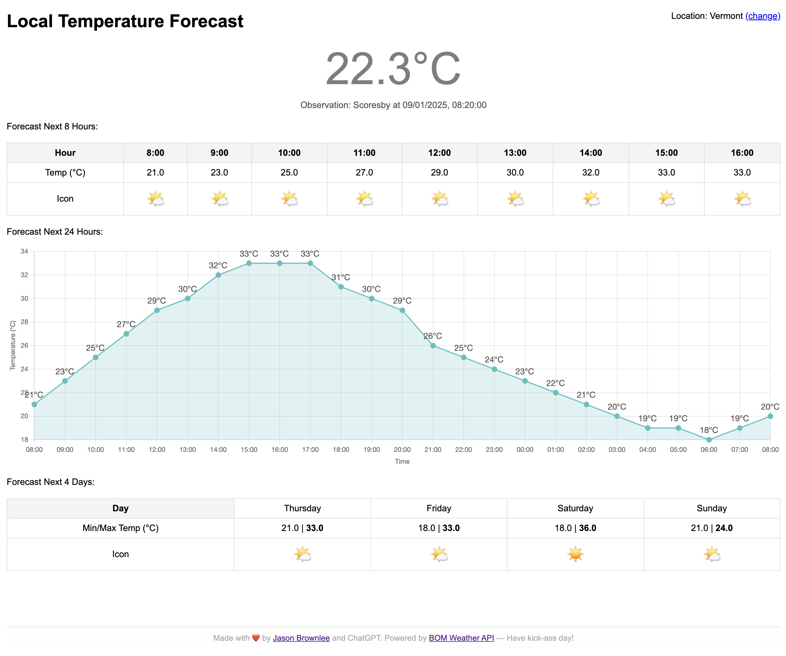

# Local Temperature Forecast (Australia only)

The repository hosts and serves the files for a simple one-page website to summarize the temperature forecast for the weather station (Scoresby, Victoria) closest to my house (Vermont, Victoria).

**Update**: Added a suburb chooser, so that you can customize for where _you_ live!

Visit: https://jasonbrownlee.me/Temperature/

## Screenshot:

## Testing

* https://api.weather.bom.gov.au/v1/locations/r1r28p/forecasts/hourly
* https://api.weather.bom.gov.au/v1/locations/r1r28p/observations
* https://api.weather.bom.gov.au/v1/locations?search=vermont